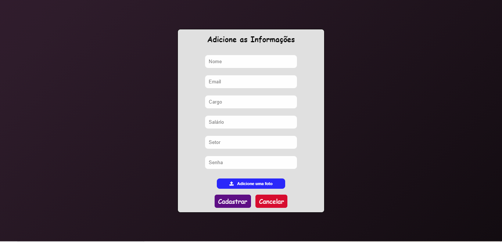

<h1>Cadastro de Funcionários </h1>

                         

 
 

<h3><a href="http://crud-usuario.eastus2.cloudapp.azure.com:3000/">Acesse o site </a></h3>

----

### 🔖 Sobre 

O que este projeto pode fazer?

1. O usuário acessa a página por meio de um login
2. visualizar os registros na página principal
3. cadastrar, editar e excluir registros

### O que é CRUD? 🤔

CRUD é a composição da primeira letra de 4 funções básicas de um sistema que trabalha com banco de dados:

✅ C: Create (criar) - criar um novo registro.

👁 R: Read (ler) - ler (exibir) as informações de um registro.

♻️ U: Update (atualizar) - atualiza os dados do registro.

❌ D: Delete (apagar) - apaga um registro.

Por exemplo, se você precisa desenvolver desde uma simples agenda telefônica até um sistema complexo de gestão de faturamento de pedidos, você precisará realizar essas 4 ações para manipular as tabelas do banco de dados de seu sistema.

Do ponto de vista do desenvolvedor, ele precisará criar as tabelas (modelos) do banco de dados, funções (controles) que atualizarão o banco de dados e as interfaces (visões), como página web ou aplicativo mobile, em que os usuários irão interagir com os dados.

Em sistemas mais sofisticados, os dados do CRUD podem ser manipulados por outros sistemas via API - Application Programming Interface (em tradução livre, “Interface de Programação de Aplicativos”).

[Saiba mais](https://angelopublio.com.br/blog/crud).

### :rocket: Tecnologias 

- HTML5 e CSS3
- Node.js
- Javascript
- MySQL
- Azure (Vm no azure hospeda as páginas web)
- Git e GitHub

----

### Ferramentas utilizadas: 

- [Trello](https://trello.com/home) para criar as tarefas de cada integrante e separar responsabilidades

  

##

- [Discord](https://discord.com/) para manter comunicação e fazer reuniões diárias sobre o projeto

##

- [Teams](https://www.microsoft.com/pt-br/microsoft-teams/group-chat-software) para comunicação com o professor e integrantes do grupo durante as aulas

----

### Integrantes do grupo 🧑‍🎓 👩‍🎓

- [Allan Santos](https://github.com/Dev-allanSantos)
- [Antonio Augusto](https://github.com/Antonio1711)
- [Athilas Silva](https://github.com/Athilas-Silva)
- [João Duarte](https://github.com/JaoDuarte)
- [Larissa Soares](https://github.com/larizwn)
- [Lucas Galdino](https://github.com/LucasGaldinno)
- [Victor Eduardo](https://github.com/ViictorSR388)
