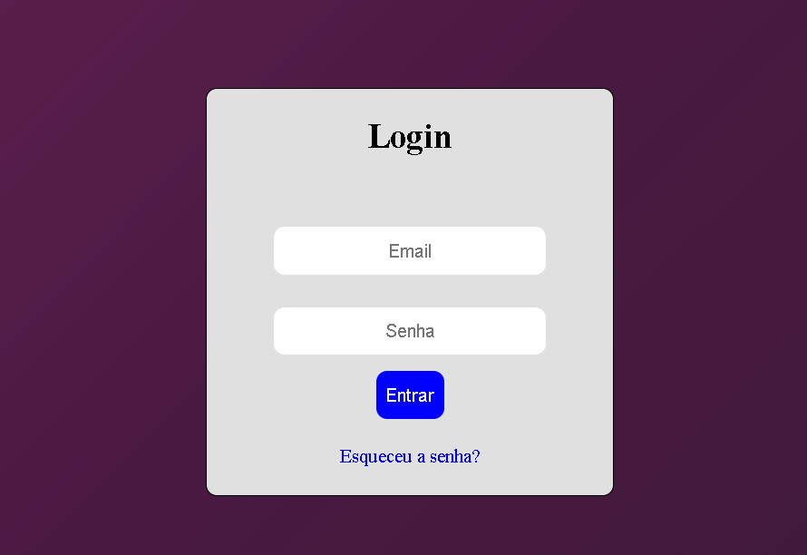
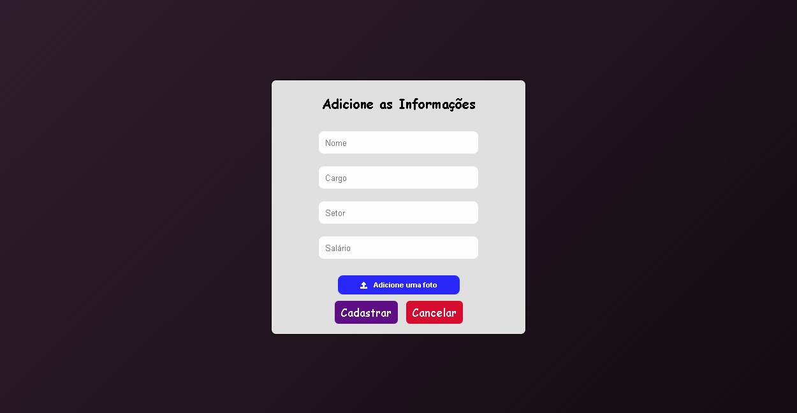

<h1>Cadastro de Usuários </h1>

//Quando houver registros na página principal eu coloco a imagem dela

<h3><a href="" >Acesse o site </a></h3>

----

### 🔖 Sobre 

O que este projeto pode fazer?

1. O usuário acessa a página por meio de um login
2. visualizar os registros na página principal
3. cadastrar, editar e excluir registros

### :rocket: Tecnologias 

- HTML5 e CSS3
- Node.js
- Javascript
- MySQL
- Azure (Vm no azure hospeda as páginas web)
- Git e GitHub

