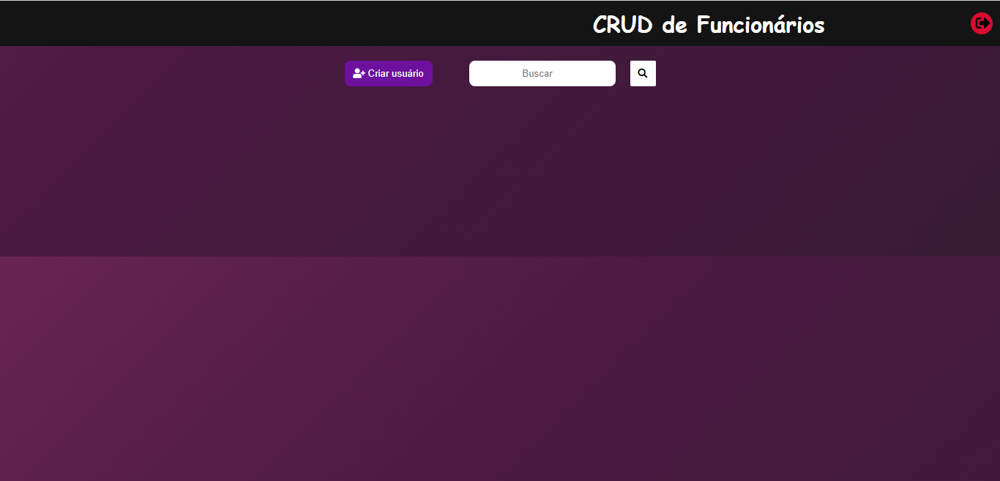

<h1>Cadastro de Usuários </h1>

<h3><a href="" >Acesse o site </a></h3>

----

### 🔖 Sobre 

O que este projeto pode fazer?

1. O usuário acessa a página por meio de um login
2. visualizar os registros na página principal
3. cadastrar, editar e excluir registros

### :rocket: Tecnologias 

- HTML5 e CSS3
- Node.js
- Javascript
- MySQL
- Azure (Vm no azure hospeda as páginas web)
- Git e GitHub

----

### Ferramentas utilizadas: 

- [Trello](https://trello.com/home) para criar as tarefas de cada integrante e separar responsabilidades

  

##

- [Discord](https://discord.com/) para manter comunicação e fazer reuniões diárias sobre o projeto

##

- [Teams](https://www.microsoft.com/pt-br/microsoft-teams/group-chat-software) para comunicação com o professor e integrantes do grupo durante as aulas

----

### Integrantes do grupo 🧑‍🎓 👩‍🎓

- [Allan Santos](https://github.com/Dev-allanSantos)
- [Antonio Augusto](https://github.com/Antonio1711)
- [Athilas Silva](https://github.com/Athilas-Silva)
- [João Duarte](https://github.com/JaoDuarte)
- [Larissa Soares](https://github.com/larizwn)
- [Lucas Galdino](https://github.com/LucasGaldinno)
- [Victor Eduardo](https://github.com/ViictorSR388)
